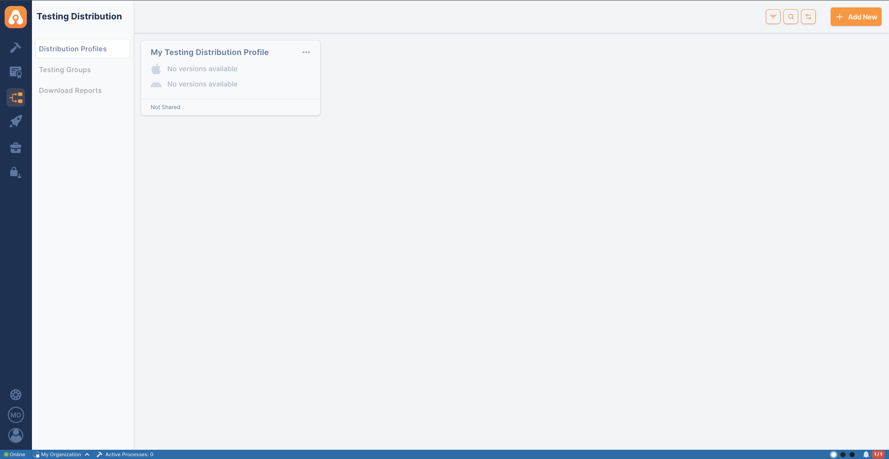
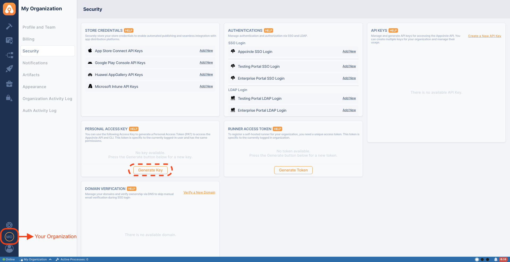

## Appcircle Testing Distribution

Appcircle Testing Distribution enables the binary distribution of Android (.apk,
.aab) and iOS (.ipa) files, allowing teams to create test groups and share builds
using enterprise authentication methods such as SSO and LDAP. Learn more about
[Appcircle testing distribution](https://appcircle.io/testing-distribution?utm_source=github&utm_medium=plugin&utm_campaign=testing_distribution)

Appcircle's Testing Distribution action enables developers to create test groups
and share builds with them, utilizing enterprise-grade authentication methods.
With the GitHub Marketplace, this module is accessible directly from your
workflows.

## Exploring Testing Distribution

Testing distribution is the process of distributing test builds to designated
test groups or individuals. This process allows developers to gather quick
feedback, identify bugs, and ensure the quality of software applications before
releasing them to customers. Appcircle's Testing Distribution module enables
developers to create test groups and share builds with them, utilizing
enterprise-grade authentication methods.

## Benefits of Using Testing Distribution

1. **Simplified Binary Distribution**.
   - **Skip Traditional Stores:** Share .apk, .aab (Android) and .ipa (iOS) files
     directly, avoiding the need to use App Store TestFlight or Google Play
     Internal Testing.
2. **Streamlined Workflow:**
   - **Automated Processes:** Platforms like Appcircle automate the distribution
     process, saving time and reducing manual effort.
   - **Seamless Integration:** Integrates smoothly with existing DevOps
     pipelines, enabling efficient build and distribution workflows.
3. **Enhanced Security:**
   - **Controlled Access:** Set specific permissions for who can access the test
     builds using enterprise authentication methods such as LDAP & SSO.
   - **Confidentiality:** Ensures that only authorized testers have access to
     the builds, protecting sensitive information.
4. **Efficient Resource Management:**
   - **Targeted Testing:** Allows the creation of specific test groups, ensuring
     that the right people are testing the right features.
   - **Optimized Testing:** Helps in allocating resources effectively, leading
     to better utilization of testing resources.
5. **Reduced Time to Market:**
   - **Eliminates Approval Delays:** By bypassing store approval processes,
     developers can distribute builds directly to testers, speeding up the
     testing cycle.
   - **Continuous Delivery:** Supports continuous delivery practices, enabling
     faster iterations and quicker releases.
6. **Faster Feedback Loop:**
   - **Quick Issue Identification:** Distributing test builds quickly allows
     developers to gather immediate feedback, identify bugs, and address issues
     early in the development cycle.
   - **Improved Quality:** Continuous testing helps ensure the software meets
     quality standards before release, reducing the likelihood of post-release
     issues.
7. **Cost-Effective:**
   - **Reduced Overheads:** Automating the distribution reduces the need for
     manual intervention, cutting down operational costs.
   - **Efficient Bug Fixes:** Early detection and fixing of bugs prevent costly
     fixes later in the development process.
8. **Enhanced User Experience:**
   - **Better Quality Control:** Ensures that end users receive a more stable
     and polished product.
   - **Customer Satisfaction:** By delivering higher quality software, customer
     satisfaction and trust in the product increase.

9. **Re-Sign and Auto-Resign:**
   - **Update Without Rebuilding:** Re-sign iOS and Android binaries with updated signing identities, manually or automatically, and keep distributing without a new build.

Overall, using testing distribution in mobile DevOps significantly enhances the
efficiency, security, and effectiveness of the software development process,
leading to better products and faster delivery times.

## System Requirements

**Compatible Agents:**

- macos-14 (arm64)
- Ubuntu-22.04

Note: Both **Appcircle Cloud** and **self-hosted** Appcircle installations are
supported. See [Self-Hosted Appcircle](#self-hosted-appcircle) below to configure
custom endpoints.

### Testing Distribution

In order to share your builds with testers, you can create distribution profiles
and assign testing groups to the distribution profiles.



### Generating/Managing the Personal API Tokens

To generate a Personal API Token, follow these steps:

1. Open the **My Organization** screen from your profile avatar at the bottom left.
2. Go to the **Security** section and find the **Personal Access Key** card.
3. Press **Generate Key** to generate your token.



## How to use Appcircle Testing Distribution Action

To share your builds with testers, you can create distribution profiles and
assign testing groups to these profiles. Add the Appcircle Testing Distribution
step to your workflow with the appropriate inputs.

```yaml
- name: Publish App to Appcircle
  id: testing-distribution-appcircle
  uses: appcircleio/appcircle-testing-distribution-githubaction
  with:
    personalAPIToken: ${{ secrets.AC_PROFILE_API_TOKEN }}
    profileName: ${{ secrets.AC_PROFILE_NAME }}
    createProfileIfNotExists: ${{ secrets.CREATE_PROFILE_IF_NOT_EXISTS }}
    appPath: ${{ secrets.APP_PATH }}
    message: ${{ secrets.MESSAGE }}
```

- `personalAPIToken`: The Appcircle Personal API token is utilized to
  authenticate and secure access to Appcircle services, ensuring that only
  authorized users can perform actions within the platform.
- `profileName`: Specifies the profile that will be used for uploading the app.
- `createProfileIfNotExists`: Ensures that a user profile is automatically
  created if it does not already exist; if the profile name already exists, the
  app will be uploaded to that existing profile instead.
- `appPath`: Indicates the file path to the application that will be uploaded to
  Appcircle Testing Distribution Profile.
- `message`: Your message to testers, ensuring they receive important updates
  and information regarding the application.

### Self-Hosted Appcircle

If you run a self-hosted Appcircle installation, point the action to your own
servers with the optional `authEndpoint` and `apiEndpoint` inputs. When omitted,
they default to the Appcircle cloud (`https://auth.appcircle.io` and
`https://api.appcircle.io`), so existing cloud workflows keep working without any
change.

```yaml
- name: Publish App to Appcircle
  uses: appcircleio/appcircle-testing-distribution-githubaction
  with:
    personalAPIToken: ${{ secrets.AC_PROFILE_API_TOKEN }}
    profileName: ${{ secrets.AC_PROFILE_NAME }}
    createProfileIfNotExists: ${{ secrets.CREATE_PROFILE_IF_NOT_EXISTS }}
    appPath: ${{ secrets.APP_PATH }}
    message: ${{ secrets.MESSAGE }}
    authEndpoint: https://auth.your-appcircle-domain.com
    apiEndpoint: https://api.your-appcircle-domain.com
```

- `authEndpoint`: Base URL of the self-hosted Appcircle authentication server.
  Optional; defaults to `https://auth.appcircle.io`.
- `apiEndpoint`: Base URL of the self-hosted Appcircle API server. Optional;
  defaults to `https://api.appcircle.io`.

> **Self-signed or private CA certificates:** If your self-hosted Appcircle server
> uses a self-signed certificate (or one issued by a private/internal CA), requests
> will fail certificate validation. The action does not disable TLS verification.
> Trust the server's CA on the runner: set the `NODE_EXTRA_CA_CERTS` environment
> variable to a PEM file containing the CA certificate, or add the CA to the system
> certificate store.

### Leveraging Environment Variables

Utilize environment variables seamlessly by substituting the parameters with
`${{ envs.VARIABLE_NAME }}` in your workflow inputs. The action automatically
retrieves values from the specified environment variables within your pipeline.

**Ensure that this action is added after build steps have been completed.**

**If multiple workflows start simultaneously, the order in which versions are
shared in the Testing Distribution is determined by the execution order of the
publish step. The version that completes its build and triggers the publish
plugin first will be shared first, followed by the others in sequence.**

Efficiently distribute test binaries or beta versions using Appcircle, featuring
seamless IPA and APK distribution capabilities. Streamline your testing process
with our versatile tool designed to optimize your distribution workflow. If you
need support or more information, please
[contact us](https://appcircle.io/contact?utm_source=github&utm_medium=plugin&utm_campaign=testing_distribution)

### Reference

- For details on generating an Appcircle Personal API Token, visit
  [Generating/Managing Personal API Tokens](https://docs.appcircle.io/appcircle-api/api-authentication#generatingmanaging-the-personal-api-tokens?utm_source=github&utm_medium=plugin&utm_campaign=testing_distribution)

- To create or learn more about Appcircle testing and distribution profiles,
  please refer to
  [Creating or Selecting a Distribution Profile](https://docs.appcircle.io/distribute/create-or-select-a-distribution-profile?utm_source=github&utm_medium=plugin&utm_campaign=testing_distribution)

- For the full action setup guide, see the
  [Appcircle Testing Distribution documentation](https://docs.appcircle.io/marketplace/github-marketplace/testing-distribution?utm_source=github&utm_medium=plugin&utm_campaign=testing_distribution)
